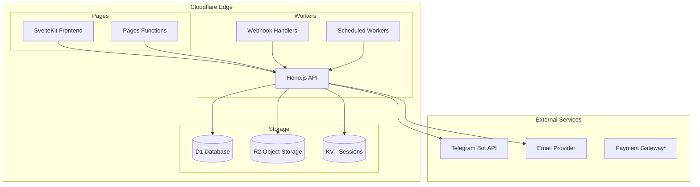
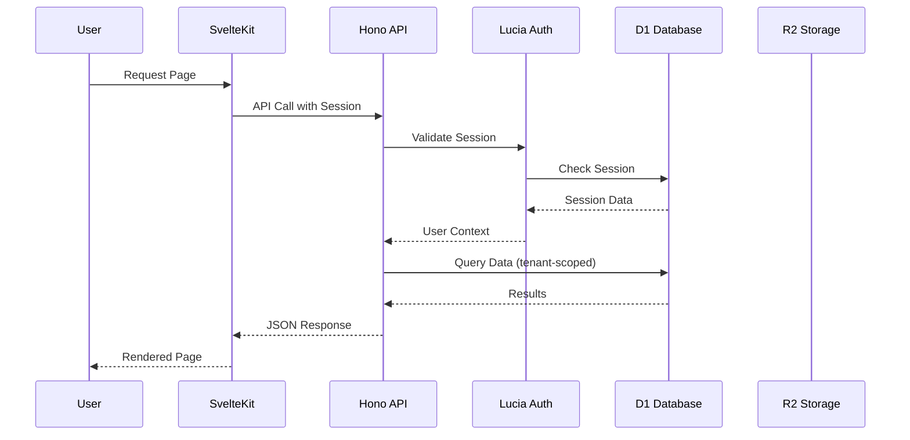
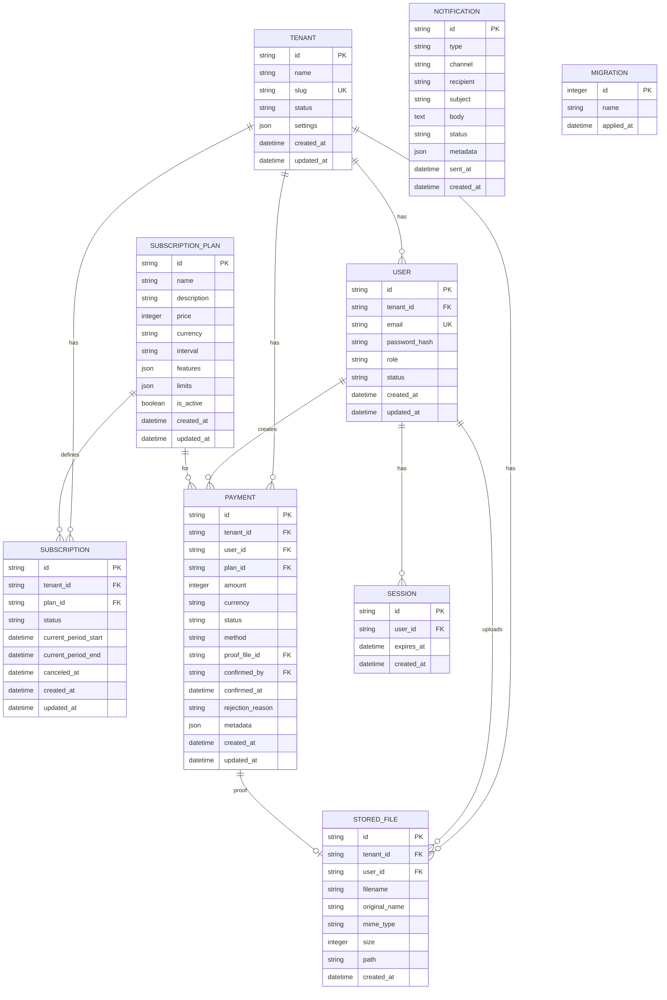

# Design Document: Cloudflare SaaS Boilerplate

## Overview

Cloudflare SaaS Boilerplate adalah template full-stack yang dirancang untuk membangun aplikasi SaaS dengan cepat di platform Cloudflare. Arsitektur ini memanfaatkan edge computing untuk performa optimal dengan biaya minimal.

### Tech Stack

| Layer | Technology | Purpose |
|-------|------------|---------|
| Frontend | SvelteKit | SSR/SSG dengan Pages Functions |
| Backend | Hono.js | Lightweight API di Workers |
| Database | D1 | SQLite-based serverless database |
| Storage | R2 | S3-compatible object storage |
| Auth | Lucia | Session-based authentication |
| UI | shadcn/svelte + Tailwind | Component library |
| Deploy | wrangler + c3 CLI | Cloudflare deployment tools |

### Key Design Principles

1. **Edge-First**: Semua compute berjalan di edge untuk latency minimal
2. **Cost-Effective**: Memanfaatkan free tier dan pay-as-you-go
3. **Type-Safe**: TypeScript end-to-end
4. **Extensible**: Plugin-based architecture untuk payment dan notification
5. **Multi-Tenant**: Data isolation by design

## Architecture

### High-Level Architecture



### Request Flow



### Project Structure

```
cloudflare-saas-boilerplate/
├── apps/
│   ├── web/                    # SvelteKit Frontend
│   │   ├── src/
│   │   │   ├── lib/
│   │   │   │   ├── components/ # UI Components
│   │   │   │   ├── stores/     # Svelte Stores
│   │   │   │   ├── utils/      # Utilities
│   │   │   │   └── api.ts      # API Client
│   │   │   ├── routes/         # SvelteKit Routes
│   │   │   └── app.html
│   │   ├── static/
│   │   └── svelte.config.js
│   │
│   └── api/                    # Hono.js Workers
│       ├── src/
│       │   ├── routes/         # API Routes
│       │   ├── middleware/     # Hono Middleware
│       │   ├── services/       # Business Logic
│       │   ├── repositories/   # Data Access
│       │   └── index.ts
│       └── wrangler.toml
│
├── packages/
│   ├── shared/                 # Shared Types & Utils
│   │   ├── src/
│   │   │   ├── types/          # TypeScript Types
│   │   │   ├── validators/     # Zod Schemas
│   │   │   └── constants/      # Shared Constants
│   │   └── package.json
│   │
│   ├── db/                     # Database Package
│   │   ├── src/
│   │   │   ├── schema/         # Table Definitions
│   │   │   ├── migrations/     # SQL Migrations
│   │   │   ├── repositories/   # Repository Classes
│   │   │   └── index.ts
│   │   └── package.json
│   │
│   └── ui/                     # UI Component Package
│       ├── src/
│       │   ├── components/     # shadcn/svelte components
│       │   └── styles/         # Tailwind config
│       └── package.json
│
├── scripts/                    # CLI Scripts
│   ├── setup.ts               # Initial setup
│   ├── migrate.ts             # Run migrations
│   └── seed.ts                # Seed data
│
├── wrangler.toml              # Root Cloudflare config
├── package.json               # Root package.json
├── pnpm-workspace.yaml        # PNPM workspace config
└── turbo.json                 # Turborepo config
```

## Components and Interfaces

### 1. Authentication Module

```typescript
// packages/shared/src/types/auth.ts
interface User {
  id: string;
  email: string;
  passwordHash: string;
  role: UserRole;
  tenantId: string;
  status: UserStatus;
  createdAt: Date;
  updatedAt: Date;
}

type UserRole = 'super_admin' | 'admin' | 'user';
type UserStatus = 'active' | 'inactive' | 'pending';

interface Session {
  id: string;
  userId: string;
  expiresAt: Date;
  tenantId: string;
}

interface AuthContext {
  user: User;
  session: Session;
  tenant: Tenant;
}

// apps/api/src/services/auth.service.ts
interface IAuthService {
  register(data: RegisterInput): Promise<Result<User, AuthError>>;
  login(data: LoginInput): Promise<Result<Session, AuthError>>;
  logout(sessionId: string): Promise<Result<void, AuthError>>;
  validateSession(sessionId: string): Promise<Result<AuthContext, AuthError>>;
  resetPassword(data: ResetPasswordInput): Promise<Result<void, AuthError>>;
  changePassword(data: ChangePasswordInput): Promise<Result<void, AuthError>>;
}
```

### 2. Tenant Module

```typescript
// packages/shared/src/types/tenant.ts
interface Tenant {
  id: string;
  name: string;
  slug: string;
  status: TenantStatus;
  settings: TenantSettings;
  createdAt: Date;
  updatedAt: Date;
}

type TenantStatus = 'active' | 'inactive' | 'suspended';

interface TenantSettings {
  features: string[];
  limits: TenantLimits;
  branding?: TenantBranding;
}

interface TenantLimits {
  maxUsers: number;
  maxStorage: number; // in bytes
}

// apps/api/src/services/tenant.service.ts
interface ITenantService {
  create(data: CreateTenantInput): Promise<Result<Tenant, TenantError>>;
  getById(id: string): Promise<Result<Tenant, TenantError>>;
  getBySlug(slug: string): Promise<Result<Tenant, TenantError>>;
  update(id: string, data: UpdateTenantInput): Promise<Result<Tenant, TenantError>>;
  deactivate(id: string): Promise<Result<void, TenantError>>;
}
```

### 3. Payment Module

```typescript
// packages/shared/src/types/payment.ts
interface Payment {
  id: string;
  tenantId: string;
  userId: string;
  amount: number;
  currency: string;
  status: PaymentStatus;
  method: PaymentMethod;
  proofUrl?: string;
  confirmedBy?: string;
  confirmedAt?: Date;
  rejectionReason?: string;
  metadata: Record<string, unknown>;
  createdAt: Date;
  updatedAt: Date;
}

type PaymentStatus = 'pending' | 'confirmed' | 'rejected' | 'expired';
type PaymentMethod = 'qris' | 'bank_transfer' | 'gateway';

interface PaymentInput {
  amount: number;
  currency: string;
  method: PaymentMethod;
  subscriptionPlanId: string;
}

// apps/api/src/services/payment.service.ts
interface IPaymentService {
  create(userId: string, data: PaymentInput): Promise<Result<Payment, PaymentError>>;
  uploadProof(paymentId: string, file: File): Promise<Result<Payment, PaymentError>>;
  confirm(paymentId: string, adminId: string): Promise<Result<Payment, PaymentError>>;
  reject(paymentId: string, adminId: string, reason: string): Promise<Result<Payment, PaymentError>>;
  getByUser(userId: string, pagination: Pagination): Promise<Result<PaginatedResult<Payment>, PaymentError>>;
  getPending(pagination: Pagination): Promise<Result<PaginatedResult<Payment>, PaymentError>>;
}
```

### 4. Subscription Module

```typescript
// packages/shared/src/types/subscription.ts
interface SubscriptionPlan {
  id: string;
  name: string;
  description: string;
  price: number;
  currency: string;
  interval: BillingInterval;
  features: PlanFeature[];
  limits: PlanLimits;
  isActive: boolean;
  createdAt: Date;
  updatedAt: Date;
}

type BillingInterval = 'monthly' | 'yearly' | 'lifetime';

interface PlanFeature {
  key: string;
  name: string;
  description?: string;
}

interface PlanLimits {
  [key: string]: number;
}

interface Subscription {
  id: string;
  tenantId: string;
  planId: string;
  status: SubscriptionStatus;
  currentPeriodStart: Date;
  currentPeriodEnd: Date;
  canceledAt?: Date;
  createdAt: Date;
  updatedAt: Date;
}

type SubscriptionStatus = 'active' | 'canceled' | 'expired' | 'past_due';

// apps/api/src/services/subscription.service.ts
interface ISubscriptionService {
  createPlan(data: CreatePlanInput): Promise<Result<SubscriptionPlan, SubscriptionError>>;
  getPlans(): Promise<Result<SubscriptionPlan[], SubscriptionError>>;
  subscribe(tenantId: string, planId: string, paymentId: string): Promise<Result<Subscription, SubscriptionError>>;
  cancel(subscriptionId: string): Promise<Result<Subscription, SubscriptionError>>;
  checkAccess(tenantId: string, feature: string): Promise<Result<boolean, SubscriptionError>>;
  getByTenant(tenantId: string): Promise<Result<Subscription | null, SubscriptionError>>;
}
```

### 5. Notification Module

```typescript
// packages/shared/src/types/notification.ts
interface Notification {
  id: string;
  type: NotificationType;
  channel: NotificationChannel;
  recipient: string;
  subject?: string;
  body: string;
  status: NotificationStatus;
  metadata: Record<string, unknown>;
  sentAt?: Date;
  createdAt: Date;
}

type NotificationType = 
  | 'payment_pending'
  | 'payment_confirmed'
  | 'payment_rejected'
  | 'subscription_expiring'
  | 'subscription_expired'
  | 'welcome'
  | 'password_reset';

type NotificationChannel = 'telegram' | 'email';
type NotificationStatus = 'pending' | 'sent' | 'failed';

// apps/api/src/services/notification.service.ts
interface INotificationService {
  send(data: SendNotificationInput): Promise<Result<Notification, NotificationError>>;
  sendBulk(data: SendNotificationInput[]): Promise<Result<Notification[], NotificationError>>;
  getByRecipient(recipient: string, pagination: Pagination): Promise<Result<PaginatedResult<Notification>, NotificationError>>;
}

// Channel Adapters
interface INotificationChannel {
  send(notification: Notification): Promise<Result<void, NotificationError>>;
}

class TelegramChannel implements INotificationChannel {
  constructor(private botToken: string) {}
  async send(notification: Notification): Promise<Result<void, NotificationError>> { /* ... */ }
}

class EmailChannel implements INotificationChannel {
  constructor(private apiKey: string, private fromEmail: string) {}
  async send(notification: Notification): Promise<Result<void, NotificationError>> { /* ... */ }
}
```

### 6. Storage Module

```typescript
// packages/shared/src/types/storage.ts
interface StoredFile {
  id: string;
  tenantId: string;
  userId: string;
  filename: string;
  originalName: string;
  mimeType: string;
  size: number;
  path: string;
  createdAt: Date;
}

interface UploadInput {
  file: File;
  folder?: string;
}

interface SignedUrlOptions {
  expiresIn?: number; // seconds, default 3600
}

// apps/api/src/services/storage.service.ts
interface IStorageService {
  upload(userId: string, data: UploadInput): Promise<Result<StoredFile, StorageError>>;
  getSignedUrl(fileId: string, options?: SignedUrlOptions): Promise<Result<string, StorageError>>;
  delete(fileId: string): Promise<Result<void, StorageError>>;
  listByUser(userId: string, pagination: Pagination): Promise<Result<PaginatedResult<StoredFile>, StorageError>>;
}
```

### 7. API Layer

```typescript
// apps/api/src/types/api.ts
interface ApiResponse<T> {
  success: boolean;
  data?: T;
  error?: ApiError;
  meta?: ResponseMeta;
}

interface ApiError {
  code: string;
  message: string;
  details?: Record<string, unknown>;
}

interface ResponseMeta {
  pagination?: PaginationMeta;
  timestamp: string;
  requestId: string;
}

interface PaginationMeta {
  page: number;
  limit: number;
  total: number;
  totalPages: number;
}

// Result type for service layer
type Result<T, E> = 
  | { success: true; data: T }
  | { success: false; error: E };
```

### 8. Middleware Stack

```typescript
// apps/api/src/middleware/index.ts

// Authentication Middleware
const authMiddleware = async (c: Context, next: Next) => {
  const sessionId = c.req.header('Authorization')?.replace('Bearer ', '');
  if (!sessionId) {
    return c.json({ success: false, error: { code: 'UNAUTHORIZED', message: 'Missing session' } }, 401);
  }
  
  const result = await authService.validateSession(sessionId);
  if (!result.success) {
    return c.json({ success: false, error: { code: 'UNAUTHORIZED', message: 'Invalid session' } }, 401);
  }
  
  c.set('auth', result.data);
  await next();
};

// Tenant Scope Middleware
const tenantMiddleware = async (c: Context, next: Next) => {
  const auth = c.get('auth') as AuthContext;
  c.set('tenantId', auth.tenant.id);
  await next();
};

// Rate Limiting Middleware
const rateLimitMiddleware = async (c: Context, next: Next) => {
  // Implementation using Cloudflare Rate Limiting or KV
};

// Request Logging Middleware
const loggingMiddleware = async (c: Context, next: Next) => {
  const requestId = crypto.randomUUID();
  c.set('requestId', requestId);
  const start = Date.now();
  await next();
  const duration = Date.now() - start;
  console.log(JSON.stringify({
    requestId,
    method: c.req.method,
    path: c.req.path,
    status: c.res.status,
    duration
  }));
};
```

## Data Models

### Entity Relationship Diagram



### SQL Schema (D1)

```sql
-- migrations/001_initial_schema.sql

-- Tenants
CREATE TABLE tenants (
    id TEXT PRIMARY KEY,
    name TEXT NOT NULL,
    slug TEXT UNIQUE NOT NULL,
    status TEXT NOT NULL DEFAULT 'active',
    settings TEXT NOT NULL DEFAULT '{}',
    created_at TEXT NOT NULL DEFAULT (datetime('now')),
    updated_at TEXT NOT NULL DEFAULT (datetime('now'))
);

CREATE INDEX idx_tenants_slug ON tenants(slug);
CREATE INDEX idx_tenants_status ON tenants(status);

-- Users
CREATE TABLE users (
    id TEXT PRIMARY KEY,
    tenant_id TEXT NOT NULL REFERENCES tenants(id),
    email TEXT UNIQUE NOT NULL,
    password_hash TEXT NOT NULL,
    role TEXT NOT NULL DEFAULT 'user',
    status TEXT NOT NULL DEFAULT 'pending',
    created_at TEXT NOT NULL DEFAULT (datetime('now')),
    updated_at TEXT NOT NULL DEFAULT (datetime('now'))
);

CREATE INDEX idx_users_tenant ON users(tenant_id);
CREATE INDEX idx_users_email ON users(email);
CREATE INDEX idx_users_role ON users(role);

-- Sessions
CREATE TABLE sessions (
    id TEXT PRIMARY KEY,
    user_id TEXT NOT NULL REFERENCES users(id) ON DELETE CASCADE,
    expires_at TEXT NOT NULL,
    created_at TEXT NOT NULL DEFAULT (datetime('now'))
);

CREATE INDEX idx_sessions_user ON sessions(user_id);
CREATE INDEX idx_sessions_expires ON sessions(expires_at);

-- Subscription Plans
CREATE TABLE subscription_plans (
    id TEXT PRIMARY KEY,
    name TEXT NOT NULL,
    description TEXT,
    price INTEGER NOT NULL,
    currency TEXT NOT NULL DEFAULT 'IDR',
    interval TEXT NOT NULL,
    features TEXT NOT NULL DEFAULT '[]',
    limits TEXT NOT NULL DEFAULT '{}',
    is_active INTEGER NOT NULL DEFAULT 1,
    created_at TEXT NOT NULL DEFAULT (datetime('now')),
    updated_at TEXT NOT NULL DEFAULT (datetime('now'))
);

-- Subscriptions
CREATE TABLE subscriptions (
    id TEXT PRIMARY KEY,
    tenant_id TEXT NOT NULL REFERENCES tenants(id),
    plan_id TEXT NOT NULL REFERENCES subscription_plans(id),
    status TEXT NOT NULL DEFAULT 'active',
    current_period_start TEXT NOT NULL,
    current_period_end TEXT NOT NULL,
    canceled_at TEXT,
    created_at TEXT NOT NULL DEFAULT (datetime('now')),
    updated_at TEXT NOT NULL DEFAULT (datetime('now'))
);

CREATE INDEX idx_subscriptions_tenant ON subscriptions(tenant_id);
CREATE INDEX idx_subscriptions_status ON subscriptions(status);

-- Payments
CREATE TABLE payments (
    id TEXT PRIMARY KEY,
    tenant_id TEXT NOT NULL REFERENCES tenants(id),
    user_id TEXT NOT NULL REFERENCES users(id),
    plan_id TEXT REFERENCES subscription_plans(id),
    amount INTEGER NOT NULL,
    currency TEXT NOT NULL DEFAULT 'IDR',
    status TEXT NOT NULL DEFAULT 'pending',
    method TEXT NOT NULL,
    proof_file_id TEXT REFERENCES stored_files(id),
    confirmed_by TEXT REFERENCES users(id),
    confirmed_at TEXT,
    rejection_reason TEXT,
    metadata TEXT NOT NULL DEFAULT '{}',
    created_at TEXT NOT NULL DEFAULT (datetime('now')),
    updated_at TEXT NOT NULL DEFAULT (datetime('now'))
);

CREATE INDEX idx_payments_tenant ON payments(tenant_id);
CREATE INDEX idx_payments_user ON payments(user_id);
CREATE INDEX idx_payments_status ON payments(status);

-- Stored Files
CREATE TABLE stored_files (
    id TEXT PRIMARY KEY,
    tenant_id TEXT NOT NULL REFERENCES tenants(id),
    user_id TEXT NOT NULL REFERENCES users(id),
    filename TEXT NOT NULL,
    original_name TEXT NOT NULL,
    mime_type TEXT NOT NULL,
    size INTEGER NOT NULL,
    path TEXT NOT NULL,
    created_at TEXT NOT NULL DEFAULT (datetime('now'))
);

CREATE INDEX idx_files_tenant ON stored_files(tenant_id);
CREATE INDEX idx_files_user ON stored_files(user_id);

-- Notifications
CREATE TABLE notifications (
    id TEXT PRIMARY KEY,
    type TEXT NOT NULL,
    channel TEXT NOT NULL,
    recipient TEXT NOT NULL,
    subject TEXT,
    body TEXT NOT NULL,
    status TEXT NOT NULL DEFAULT 'pending',
    metadata TEXT NOT NULL DEFAULT '{}',
    sent_at TEXT,
    created_at TEXT NOT NULL DEFAULT (datetime('now'))
);

CREATE INDEX idx_notifications_recipient ON notifications(recipient);
CREATE INDEX idx_notifications_status ON notifications(status);
CREATE INDEX idx_notifications_type ON notifications(type);

-- Migrations tracking
CREATE TABLE migrations (
    id INTEGER PRIMARY KEY AUTOINCREMENT,
    name TEXT UNIQUE NOT NULL,
    applied_at TEXT NOT NULL DEFAULT (datetime('now'))
);
```


## Correctness Properties

*A property is a characteristic or behavior that should hold true across all valid executions of a system-essentially, a formal statement about what the system should do. Properties serve as the bridge between human-readable specifications and machine-verifiable correctness guarantees.*

Based on the acceptance criteria analysis, the following correctness properties must be validated through property-based testing:

### Authentication Properties

**Property 1: Session Data Round-Trip**
*For any* valid session object, serializing to JSON and then deserializing should produce an equivalent session object with all fields preserved.
**Validates: Requirements 2.7, 2.8**

**Property 2: Login Creates Valid Session**
*For any* registered user with valid credentials, login should produce a session that passes validation.
**Validates: Requirements 2.2, 2.6**

**Property 3: Invalid Credentials Rejection**
*For any* login attempt with invalid credentials (wrong password or non-existent email), the system should reject the attempt without creating a session.
**Validates: Requirements 2.3**

**Property 4: Logout Invalidates Session**
*For any* valid session, after logout, that session should fail validation.
**Validates: Requirements 2.5**

**Property 5: Password Reset Token Uniqueness**
*For any* password reset request, the generated token should be unique and not match any existing tokens.
**Validates: Requirements 2.4**


### User Management Properties

**Property 6: User Pagination Invariant**
*For any* set of users and pagination parameters, the total count of items across all pages should equal the total number of users matching the filter criteria.
**Validates: Requirements 3.1**

**Property 7: User Search Filter Accuracy**
*For any* search query, all returned users should match the search criteria (email, name, or role contains the search term).
**Validates: Requirements 3.5**

**Property 8: User Deactivation Cascades to Sessions**
*For any* user that is deactivated, all sessions belonging to that user should become invalid.
**Validates: Requirements 3.4**

### Tenant Isolation Properties

**Property 9: Tenant Data Isolation**
*For any* database query executed in a tenant context, the results should only contain records belonging to that tenant. No cross-tenant data leakage should occur.
**Validates: Requirements 4.2, 4.5**

**Property 10: Tenant ID Uniqueness**
*For any* two tenants created, their IDs should be different.
**Validates: Requirements 4.1**

**Property 11: Deactivated Tenant Access Denial**
*For any* user belonging to a deactivated tenant, all API requests should be rejected with appropriate error.
**Validates: Requirements 4.4**

**Property 12: Tenant Settings Persistence**
*For any* tenant settings update, reading the settings back should return the updated values.
**Validates: Requirements 4.3**


### Payment Properties

**Property 13: Payment Data Round-Trip**
*For any* valid payment object, serializing to JSON for API response and deserializing from request should preserve all payment fields.
**Validates: Requirements 5.7, 5.8**

**Property 14: Payment Creation Sets Pending Status**
*For any* new payment initiation, the created payment record should have status 'pending'.
**Validates: Requirements 5.1**

**Property 15: Payment Confirmation Updates Status**
*For any* pending payment that is confirmed, the status should change to 'confirmed' and the subscription should be activated.
**Validates: Requirements 5.4**

**Property 16: Payment Rejection Preserves Reason**
*For any* payment rejection with a reason, the rejection reason should be stored and retrievable.
**Validates: Requirements 5.5**

**Property 17: Pending Payments Filter**
*For any* query for pending payments, all returned payments should have status 'pending'.
**Validates: Requirements 5.3**

### Subscription Properties

**Property 18: Active Plans Filter**
*For any* query for available plans, all returned plans should have isActive = true.
**Validates: Requirements 6.1**

**Property 19: Feature Access Matches Subscription**
*For any* feature access check, the result should be true if and only if the tenant has an active subscription with a plan that includes that feature.
**Validates: Requirements 6.4**

**Property 20: Expired Subscription Restricts Access**
*For any* subscription past its currentPeriodEnd date, feature access checks should return false for premium features.
**Validates: Requirements 6.3**


### Notification Properties

**Property 21: Notification Channel Routing**
*For any* notification with configured channels, the notification should be sent to all enabled channels for that notification type.
**Validates: Requirements 7.1, 7.5**

**Property 22: Notification Payload Serialization**
*For any* notification payload, serializing to JSON for the target channel API should produce valid JSON with all required fields.
**Validates: Requirements 7.6**

**Property 23: Failed Notification Retry**
*For any* notification that fails to send, the system should retry according to the configured retry policy before marking as failed.
**Validates: Requirements 7.4**

### Storage Properties

**Property 24: File Type Validation**
*For any* file upload, if the file type is not in the allowed list, the upload should be rejected.
**Validates: Requirements 8.1**

**Property 25: File Size Validation**
*For any* file upload exceeding the size limit, the upload should be rejected with appropriate error.
**Validates: Requirements 8.5**

**Property 26: Signed URL Expiration**
*For any* signed URL generated with an expiration time, the URL should be valid before expiration and invalid after.
**Validates: Requirements 8.2**

**Property 27: File Deletion Consistency**
*For any* file deletion, both the R2 object and database record should be removed.
**Validates: Requirements 8.3**

**Property 28: File Listing Tenant Scope**
*For any* file listing request, all returned files should belong to the requesting user's tenant.
**Validates: Requirements 8.4**


### API Layer Properties

**Property 29: API Response Consistency**
*For any* API response, the JSON structure should contain success (boolean), and either data or error fields, plus meta with timestamp and requestId.
**Validates: Requirements 9.2, 9.6**

**Property 30: API Error Status Codes**
*For any* API error, the HTTP status code should match the error type (400 for validation, 401 for auth, 403 for forbidden, 404 for not found, 500 for server errors).
**Validates: Requirements 9.3**

**Property 31: Rate Limit Response**
*For any* request that exceeds rate limit, the response should be 429 with retry-after header.
**Validates: Requirements 9.4**

**Property 32: Request Body Validation**
*For any* API request with invalid JSON body, the system should return 400 with validation error details.
**Validates: Requirements 9.5**

### Migration Properties

**Property 33: Migration Order Preservation**
*For any* set of migrations, they should be applied in chronological order based on timestamp.
**Validates: Requirements 10.1**

**Property 34: Migration Rollback Round-Trip**
*For any* applied migration, rolling back and re-applying should result in the same database state.
**Validates: Requirements 10.3**

**Property 35: Migration Status Accuracy**
*For any* migration, the status query should correctly report whether it has been applied or is pending.
**Validates: Requirements 10.4**


### Webhook Properties

**Property 36: Webhook Signature Validation**
*For any* webhook with signature verification enabled, webhooks with invalid signatures should be rejected.
**Validates: Requirements 12.1**

**Property 37: Webhook Payload Parsing**
*For any* valid webhook payload, parsing should produce the expected data structure matching the webhook type schema.
**Validates: Requirements 12.5**

**Property 38: Webhook Routing**
*For any* webhook type, the payload should be routed to the correct registered handler.
**Validates: Requirements 12.2**

### Logging Properties

**Property 39: Log Entry Completeness**
*For any* logged event, the log entry should contain timestamp, level, message, and context fields.
**Validates: Requirements 13.1**

**Property 40: Error Log Stack Trace**
*For any* error log, the entry should include the stack trace and request context.
**Validates: Requirements 13.2**

**Property 41: Log Filter Accuracy**
*For any* log query with filters, all returned entries should match the filter criteria (level, time range, context).
**Validates: Requirements 13.3**

**Property 42: Log Entry Serialization**
*For any* log entry, serializing to JSON should produce valid structured log format.
**Validates: Requirements 13.5**

### Security Properties

**Property 43: XSS Sanitization**
*For any* user input containing potential XSS vectors (script tags, event handlers), sanitization should remove or escape the dangerous content.
**Validates: Requirements 14.1**

**Property 44: Security Headers Presence**
*For any* API response, the required security headers (CSP, HSTS, X-Frame-Options) should be present.
**Validates: Requirements 14.3**

**Property 45: CORS Origin Validation**
*For any* CORS request from an origin not in the allowed list, the request should be rejected.
**Validates: Requirements 14.4**

**Property 46: Sensitive Data Encryption**
*For any* sensitive data stored in the database, the data should be encrypted and not readable in plain text.
**Validates: Requirements 14.5**


## Error Handling

### Error Types

```typescript
// packages/shared/src/types/errors.ts

// Base error class
abstract class AppError extends Error {
  abstract readonly code: string;
  abstract readonly statusCode: number;
  readonly details?: Record<string, unknown>;
  
  constructor(message: string, details?: Record<string, unknown>) {
    super(message);
    this.details = details;
  }
  
  toJSON(): ApiError {
    return {
      code: this.code,
      message: this.message,
      details: this.details
    };
  }
}

// Authentication Errors
class AuthError extends AppError {
  readonly statusCode = 401;
  
  static readonly CODES = {
    INVALID_CREDENTIALS: 'AUTH_INVALID_CREDENTIALS',
    SESSION_EXPIRED: 'AUTH_SESSION_EXPIRED',
    SESSION_INVALID: 'AUTH_SESSION_INVALID',
    USER_NOT_FOUND: 'AUTH_USER_NOT_FOUND',
    USER_INACTIVE: 'AUTH_USER_INACTIVE',
    EMAIL_EXISTS: 'AUTH_EMAIL_EXISTS',
    INVALID_TOKEN: 'AUTH_INVALID_TOKEN'
  } as const;
  
  constructor(readonly code: string, message: string, details?: Record<string, unknown>) {
    super(message, details);
  }
}

// Validation Errors
class ValidationError extends AppError {
  readonly code = 'VALIDATION_ERROR';
  readonly statusCode = 400;
  
  constructor(message: string, readonly fields: Record<string, string[]>) {
    super(message, { fields });
  }
}

// Not Found Errors
class NotFoundError extends AppError {
  readonly code = 'NOT_FOUND';
  readonly statusCode = 404;
  
  constructor(resource: string, id?: string) {
    super(`${resource} not found${id ? `: ${id}` : ''}`);
  }
}

// Forbidden Errors
class ForbiddenError extends AppError {
  readonly code = 'FORBIDDEN';
  readonly statusCode = 403;
  
  constructor(message: string = 'Access denied') {
    super(message);
  }
}

// Tenant Errors
class TenantError extends AppError {
  readonly statusCode = 403;
  
  static readonly CODES = {
    INACTIVE: 'TENANT_INACTIVE',
    NOT_FOUND: 'TENANT_NOT_FOUND',
    LIMIT_EXCEEDED: 'TENANT_LIMIT_EXCEEDED'
  } as const;
  
  constructor(readonly code: string, message: string) {
    super(message);
  }
}

// Payment Errors
class PaymentError extends AppError {
  readonly statusCode = 400;
  
  static readonly CODES = {
    INVALID_AMOUNT: 'PAYMENT_INVALID_AMOUNT',
    ALREADY_CONFIRMED: 'PAYMENT_ALREADY_CONFIRMED',
    ALREADY_REJECTED: 'PAYMENT_ALREADY_REJECTED',
    PROOF_REQUIRED: 'PAYMENT_PROOF_REQUIRED',
    NOT_FOUND: 'PAYMENT_NOT_FOUND'
  } as const;
  
  constructor(readonly code: string, message: string) {
    super(message);
  }
}

// Storage Errors
class StorageError extends AppError {
  readonly statusCode = 400;
  
  static readonly CODES = {
    FILE_TOO_LARGE: 'STORAGE_FILE_TOO_LARGE',
    INVALID_TYPE: 'STORAGE_INVALID_TYPE',
    UPLOAD_FAILED: 'STORAGE_UPLOAD_FAILED',
    NOT_FOUND: 'STORAGE_NOT_FOUND'
  } as const;
  
  constructor(readonly code: string, message: string) {
    super(message);
  }
}

// Rate Limit Error
class RateLimitError extends AppError {
  readonly code = 'RATE_LIMIT_EXCEEDED';
  readonly statusCode = 429;
  readonly retryAfter: number;
  
  constructor(retryAfter: number) {
    super('Rate limit exceeded');
    this.retryAfter = retryAfter;
  }
}
```


### Error Handling Middleware

```typescript
// apps/api/src/middleware/error.middleware.ts
import { Context } from 'hono';
import { AppError, ValidationError, RateLimitError } from '@saas/shared';

export const errorHandler = async (err: Error, c: Context) => {
  const requestId = c.get('requestId') || crypto.randomUUID();
  
  // Log error
  console.error(JSON.stringify({
    requestId,
    error: err.message,
    stack: err.stack,
    path: c.req.path,
    method: c.req.method
  }));
  
  // Handle known errors
  if (err instanceof AppError) {
    const response: ApiResponse<null> = {
      success: false,
      error: err.toJSON(),
      meta: {
        timestamp: new Date().toISOString(),
        requestId
      }
    };
    
    // Add retry-after header for rate limit errors
    if (err instanceof RateLimitError) {
      c.header('Retry-After', String(err.retryAfter));
    }
    
    return c.json(response, err.statusCode);
  }
  
  // Handle unknown errors
  const response: ApiResponse<null> = {
    success: false,
    error: {
      code: 'INTERNAL_ERROR',
      message: 'An unexpected error occurred'
    },
    meta: {
      timestamp: new Date().toISOString(),
      requestId
    }
  };
  
  return c.json(response, 500);
};
```

### Result Type Pattern

```typescript
// packages/shared/src/types/result.ts

type Result<T, E extends AppError = AppError> = 
  | { success: true; data: T }
  | { success: false; error: E };

// Helper functions
const ok = <T>(data: T): Result<T, never> => ({ success: true, data });
const err = <E extends AppError>(error: E): Result<never, E> => ({ success: false, error });

// Usage in services
class AuthService implements IAuthService {
  async login(data: LoginInput): Promise<Result<Session, AuthError>> {
    const user = await this.userRepo.findByEmail(data.email);
    if (!user) {
      return err(new AuthError(
        AuthError.CODES.INVALID_CREDENTIALS,
        'Invalid email or password'
      ));
    }
    
    const validPassword = await verifyPassword(data.password, user.passwordHash);
    if (!validPassword) {
      return err(new AuthError(
        AuthError.CODES.INVALID_CREDENTIALS,
        'Invalid email or password'
      ));
    }
    
    const session = await this.sessionRepo.create(user.id);
    return ok(session);
  }
}
```


## Testing Strategy

### Testing Framework

| Type | Framework | Purpose |
|------|-----------|---------|
| Unit Tests | Vitest | Fast unit testing with TypeScript support |
| Property-Based Tests | fast-check | Property-based testing for correctness properties |
| Integration Tests | Vitest + Miniflare | Testing with Cloudflare Workers runtime |
| E2E Tests | Playwright | End-to-end browser testing |

### Property-Based Testing Approach

Property-based tests will be implemented using **fast-check** library. Each correctness property from the design document will have a corresponding property-based test.

```typescript
// Example: Property 1 - Session Data Round-Trip
import { fc } from 'fast-check';
import { describe, it, expect } from 'vitest';
import { serializeSession, deserializeSession } from '../services/auth.service';

describe('Session Serialization', () => {
  /**
   * Feature: cloudflare-saas-boilerplate, Property 1: Session Data Round-Trip
   * Validates: Requirements 2.7, 2.8
   */
  it('should preserve session data through serialization round-trip', () => {
    fc.assert(
      fc.property(
        fc.record({
          id: fc.uuid(),
          userId: fc.uuid(),
          expiresAt: fc.date({ min: new Date() }),
          tenantId: fc.uuid()
        }),
        (session) => {
          const serialized = serializeSession(session);
          const deserialized = deserializeSession(serialized);
          
          expect(deserialized.id).toBe(session.id);
          expect(deserialized.userId).toBe(session.userId);
          expect(deserialized.tenantId).toBe(session.tenantId);
          expect(deserialized.expiresAt.getTime()).toBe(session.expiresAt.getTime());
        }
      ),
      { numRuns: 100 }
    );
  });
});
```

### Test Organization

```
apps/api/
├── src/
│   ├── services/
│   │   ├── auth.service.ts
│   │   └── auth.service.test.ts      # Unit tests
│   └── ...
└── tests/
    ├── properties/                    # Property-based tests
    │   ├── auth.properties.test.ts
    │   ├── tenant.properties.test.ts
    │   ├── payment.properties.test.ts
    │   └── ...
    ├── integration/                   # Integration tests
    │   ├── auth.integration.test.ts
    │   └── ...
    └── fixtures/                      # Test fixtures and factories
        ├── user.factory.ts
        ├── tenant.factory.ts
        └── ...

apps/web/
├── src/
│   └── lib/
│       └── components/
│           └── Button.test.ts        # Component tests
└── tests/
    └── e2e/                          # E2E tests
        ├── auth.e2e.test.ts
        └── ...
```


### Test Generators (fast-check Arbitraries)

```typescript
// tests/fixtures/arbitraries.ts
import { fc } from 'fast-check';

// User arbitrary
export const userArb = fc.record({
  id: fc.uuid(),
  email: fc.emailAddress(),
  passwordHash: fc.hexaString({ minLength: 64, maxLength: 64 }),
  role: fc.constantFrom('super_admin', 'admin', 'user'),
  tenantId: fc.uuid(),
  status: fc.constantFrom('active', 'inactive', 'pending'),
  createdAt: fc.date(),
  updatedAt: fc.date()
});

// Tenant arbitrary
export const tenantArb = fc.record({
  id: fc.uuid(),
  name: fc.string({ minLength: 1, maxLength: 100 }),
  slug: fc.string({ minLength: 1, maxLength: 50 }).filter(s => /^[a-z0-9-]+$/.test(s)),
  status: fc.constantFrom('active', 'inactive', 'suspended'),
  settings: fc.record({
    features: fc.array(fc.string()),
    limits: fc.record({
      maxUsers: fc.integer({ min: 1, max: 1000 }),
      maxStorage: fc.integer({ min: 1024, max: 1073741824 })
    })
  }),
  createdAt: fc.date(),
  updatedAt: fc.date()
});

// Payment arbitrary
export const paymentArb = fc.record({
  id: fc.uuid(),
  tenantId: fc.uuid(),
  userId: fc.uuid(),
  amount: fc.integer({ min: 1000, max: 100000000 }),
  currency: fc.constant('IDR'),
  status: fc.constantFrom('pending', 'confirmed', 'rejected', 'expired'),
  method: fc.constantFrom('qris', 'bank_transfer', 'gateway'),
  metadata: fc.dictionary(fc.string(), fc.jsonValue()),
  createdAt: fc.date(),
  updatedAt: fc.date()
});

// File arbitrary
export const fileArb = fc.record({
  id: fc.uuid(),
  tenantId: fc.uuid(),
  userId: fc.uuid(),
  filename: fc.uuid().map(id => `${id}.pdf`),
  originalName: fc.string({ minLength: 1, maxLength: 255 }),
  mimeType: fc.constantFrom('application/pdf', 'image/png', 'image/jpeg'),
  size: fc.integer({ min: 1, max: 10485760 }),
  path: fc.uuid().map(id => `uploads/${id}`),
  createdAt: fc.date()
});
```

### Unit Testing Guidelines

- Test individual functions and methods in isolation
- Mock external dependencies (D1, R2, external APIs)
- Focus on business logic correctness
- Use descriptive test names that explain the scenario

### Integration Testing Guidelines

- Use Miniflare for local Cloudflare Workers runtime
- Test actual D1 queries with in-memory SQLite
- Test R2 operations with local storage
- Verify middleware chain behavior

### Property-Based Testing Requirements

1. Each correctness property MUST have a corresponding property-based test
2. Tests MUST run minimum 100 iterations
3. Tests MUST be tagged with property number and requirements reference
4. Use smart generators that constrain to valid input space
5. Property tests should not mock core logic - test real implementations

